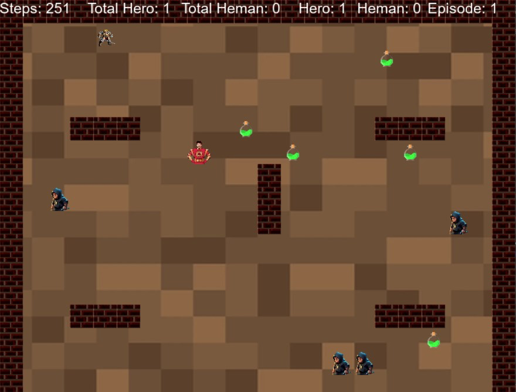

> **PROJECT** **REPORT**

**CSE** **546:** Reinforcement Learning

*Instructor*: Dr. Alina Vereshchaka

> Spring 2024

*Deadline*:

---------------------------------------------------------------------------------------------------------------------------------------

*-*--------------------------------------------------------------------------------------------------------------------------------------

**TITLE:**

> **SHAKTIMAN:** **A** **MULTI** **AGENT** **GAME** **IMPLEMENTATION**

**INTRODUCTION:**

The environment is based on
the Hunter Assassin game environment. The environment consists of
Heroes, Enemies, Walls, and Health. In this environment the core concept
of the environment is Agents killing the enemies. There will be two AI
Agents (Heman and Shakthiman) and 5 enemies, the AI agents will be
trained to kill as many enemies as possible. The agent that kills
maximum number of enemies is the winner.

**AGENTS** ***and*** ***their*** **ALGORITHMS:**

**1.** **Shakthiman:**

> Shakthiman is a DQN agent. We are using a Deep Q Network to train
> Shakthiman. DQN is a reinforcement learning algorithm introduced by
> DeepMind in 2015. It combines deep learning with Q-learning to enable
> agents to learn control policies directly from high-dimensional
> sensory inputs. In DQN, we use a Q network to approximate the expected
> Q values of a given state. By using a target network and experience
> replay, we adjust the parameters and make the Q network better. At
> certain intervals, we copy those values to the target network. Using a
> target network reduces instabilities in the deep Q networks. This
> approach has been successfully applied to various tasks, including
> playing Atari games and robotic control, demonstrating its
> effectiveness in learning complex behaviors from raw sensory data.
>
> **NOTE**: Shaktiman is also referred as Hero in some parts of our
> project.

**2.** **Heman:**

> Heman is an Actor Critic agent. We are using the A2C method for
> training Heman. A2C is an abbreviation for Advantage Actor Critic,
> which is an RL algorithm where we improve the policy network for every
> episode along with the Q network. There are two networks here: one is
> the actor network, and the other is the critic network. The critic
> network generates the Q values, and these values are sent to the actor
> network. Based on these Q values, the actor network provides action
> probabilities, and the action is chosen using these probabilities. We
> are using a multinomial distribution to sample the action. The
> parameters of the critic network are updated using mean squared error.
> The target values are calculated using the equation (reward + gamma \*
> future_return). The parameters of the actor network are updated using
> log(probabilities) \* advantage values. Using these formulas,
> backpropagation is performed, and the weights are updated to obtain
> the desired output. The action is chosen by the actor network, so we
> use the actor network for testing. The critic network is used to train
> the actor network with values.

**REWARDS:**

> The rewards will be the same for both Shakthiman and Heman.
>
> • There will be a positive reward of +1000 if the agent catches the
> enemy. The reward of 1000 will be penalized by the number of steps
> taken to catch the enemy (1000 - 2 \* number_of_steps).
>
> • Every time the agent moves closer to the enemy, there will be a
> positive reward of +100. Every time the agent moves away from the
> enemy, there will be a negative reward of -100. If there is no change
> in the distance, it will get -10 (We are using Manhattan Distance).
>
> • At the end of every episode, if Shakthiman is catching more enemies
> than Heman, then Shakthiman will get +500 and Heman will get -500, and
> vice versa.
>
> • •

**HEALTH:** •

> •

If there are still enemies left after the episode, both of them will be
rewarded -500.

If any of the agents die due to 0 health, then the agent will be
penalized with -1000.

If an agent hits the wall, then he loses 1.5 health points. The total
health is 100. If the agent dies by depleting all his health, he will be
penalized with a reward of -1000.

There are 5 health potions available that will help the agent regain
health. If the agent reaches a health

potion, then it will gain +4 health points.

**OBSERVATIONS:**

> This is a fully observable environment; the agent will be given all
> the elements present in the environment so that it can learn every
> element. There are 24 observations given to each network. The first
> four observations indicate the presence of walls in four directions
> relative to Heman. The next four observations represent the current
> direction of Heman: whether he is moving up, down, left, or right.
> Another four observations indicate the enemies' positions relative to
> Heman: whether an enemy is above, to the right, to the left, or below.
> These constitute the first 12 observations. The next 12 observations
> will be the same properties for Shakthiman. Both the Heman networks
> and Shakthiman networks will be given these 24 observations.
>
> **Steps**:
>
> The agent can take four possible steps: up, down, right, or left.

**GOAL:**

> The goal of both agents is to kill the maximum number of enemies in
> the minimum number of steps without losing health.

**TRAINING** **PLOTS:**

The blue curve represents the rewards obtained by the "Hero" agent,
which is using the Deep Q-Network (DQN) algorithm. The orange curve
represents the rewards obtained by the "Heman" agent, which is using the
Advantage Actor-Critic (A2C) algorithm.

the performance of both agents fluctuates significantly during the
initial stages of training, with periods of high rewards followed by
periods of low or negative rewards. As training progresses, the agents'
performances gradually improve, and the reward curves become smoother,
indicating more stable and consistent behavior.

The second graph is the epsilon decay curve for the training process of
2000 episodes.

**RESULTS:**

**Testing** **Actor** **Critic** **(Heman)** **by** **taking**
**another** **agent** **as** **random:**

> We can clearly see that Heman which is having Actor Critic algorithm
> is performing extremely good when
>
>  style="width:3.84861in;height:5.01148in" />compared with the random
> agent. By looking at this plot we can confirm that the A2C agent
> (Heman) is trained properly.

**Testing** **DQN** **(Hero)** **by** **taking** **another** **agent**
**as** **random:**

>  style="width:3.92986in;height:5.10681in" />We can clearly see that
> Hero which is having DQN algorithm is performing extremely good when
> compared with the random agent. By looking at this plot we can confirm
> that the DQN agent (Hero) is trained properly.

**Testing** **Both** **DQN** **andActor** **CriticAgent:**

>  style="width:3.97917in;height:5.08383in" />We can see both the agents
> are competitively getting the enemies and both of them are showing
> good results by caching the enemies with less number of steps over the
> time.

**RUNNING** **GUIDE:**

**Training:**

> You can directly run the Python code for training to see the training
> process (video is provided).

**Testing:**

> You can find 3 Testing files.
>
> 1\. Hero Random and Heman with A2C trained weights.
>
> 2\. Heman Random and Hero with DQN trained weights.
>
> 3\. Both Hero and Heman are with trained weights.

**TEAM** **CONTRIBUTION:**

> 1\. **Surya** **Suhas** **Reddy:** Worked on the Initial Development
> of the Game environment and built the project's structure - 30%.
>
> 2\. **Leela** **Satya** **Praneeth:** Worked on the DQN Model and has
> made a significant contribution in building Shakthi Man - 30%
>
> 3\. **Sai** **Venkat** **Reddy:** Worked on Actor-Critic Model and has
> made a significant contribution in building Heman - 30%
>
> We got assistance from TAs about changes and improvements in the model
> during the SCRUM Meetings,
>
> which helped us to deliver successful results - 10%.

**REFRENCES:**

> 1\. Pygame Documentation:
> [<u>https://www.pygame.org/docs/</u>](https://www.pygame.org/docs/)
>
> 2\. Mnih, V., Kavukcuoglu, K., Silver, D., Rusu, A. A., Veness, J.,
> Bellemare, M. G., ... & Petersen, S. (2015). Human-level control
> through deep reinforcement learning. Nature, 518(7540), 529-533.
> [<u>https://www.nature.com/articles/nature14236</u>](https://www.nature.com/articles/nature14236)
>
> 3\. Konda, V. R., & Tsitsiklis, J. N. (2000). Actor-critic algorithms.
> SIAM journal on control and optimization, 42(4), 1143-1166.
> [<u>https://epubs.siam.org/doi/abs/10.1137/S036301299834171X</u>](https://epubs.siam.org/doi/abs/10.1137/S036301299834171X)
>
> 4\. Mnih, V., Badia, A. P., Mirza, M., Graves, A., Lillicrap, T. P.,
> Harley, T., ... & Kavukcuoglu, K. (2016). Asynchronous methods for
> deep reinforcement learning. In International conference on machine
> learning (pp. 1928-1937).
> [<u>http://proceedings.mlr.press/v48/mniha16.pdf</u>](http://proceedings.mlr.press/v48/mniha16.pdf)
